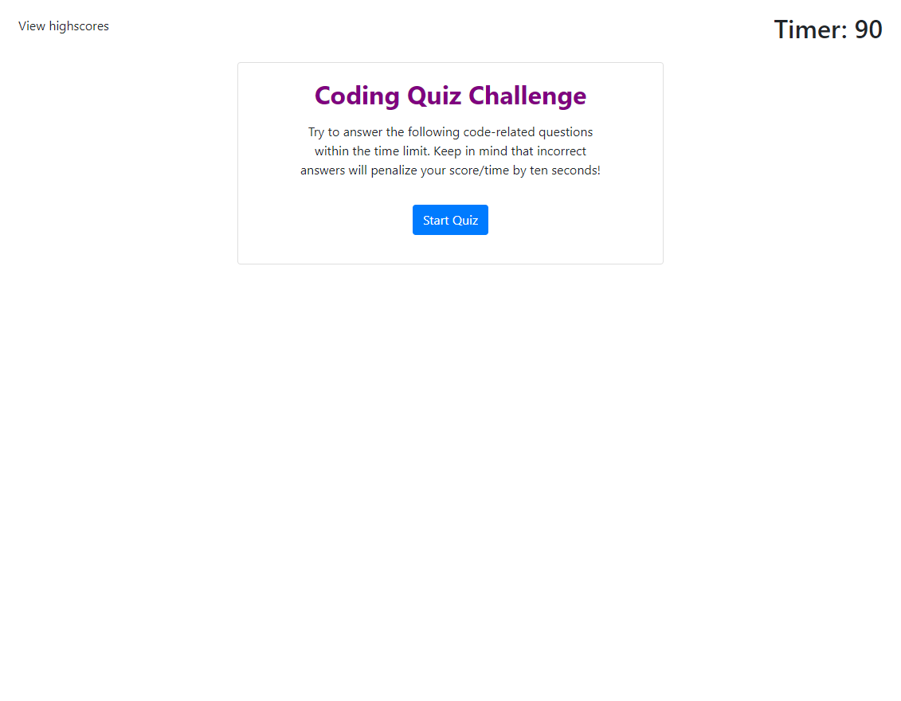
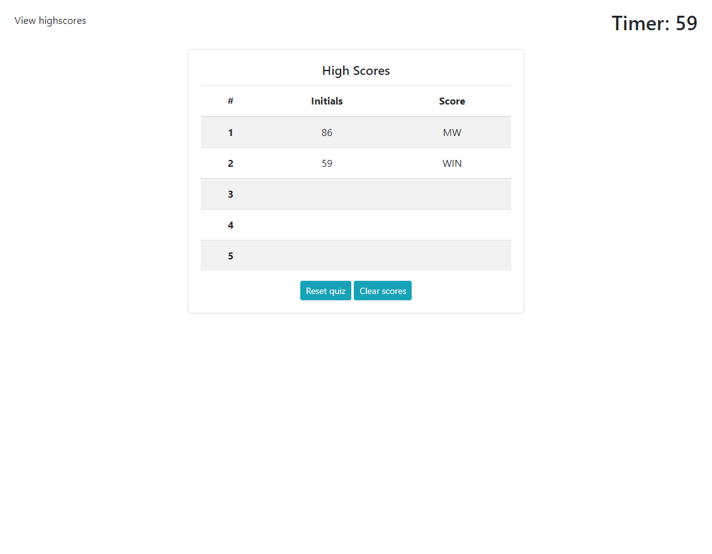
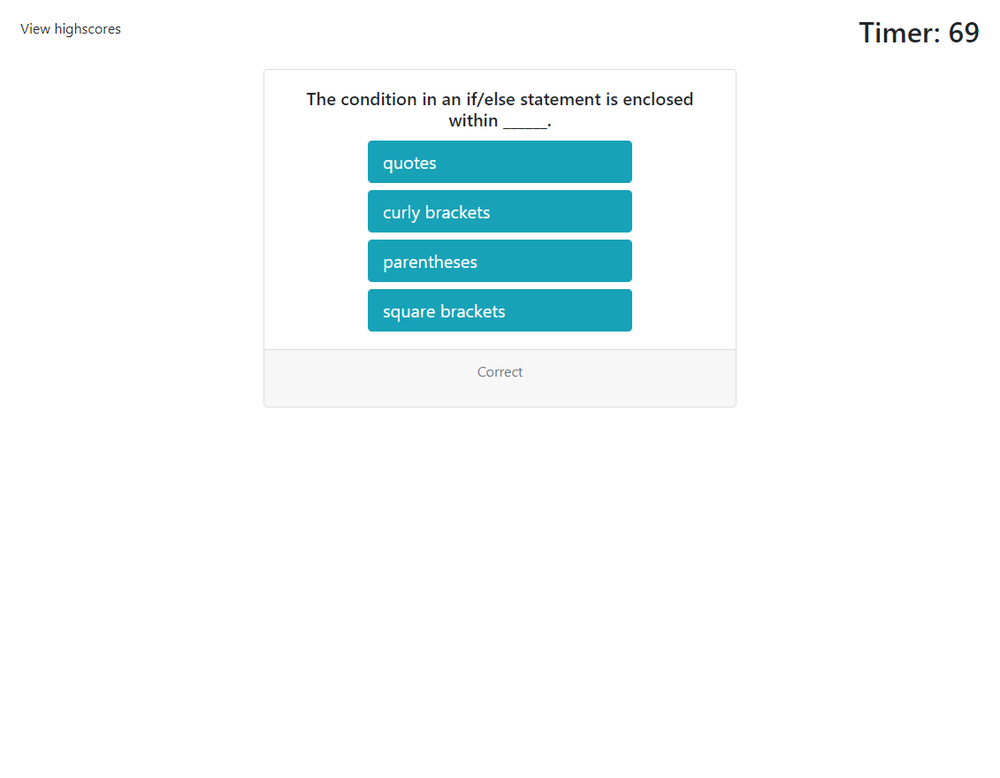
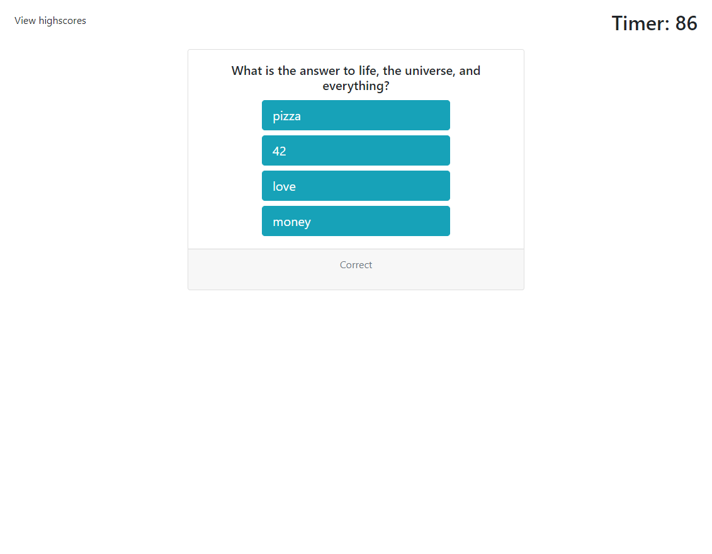

# Coding Quiz App

We were given the assignment of creating a coding quiz in which incorrect answers counted against a timer, and the amount of time left after completing all questions is the final score. 

I have found this extremely challenging, but thrilling. I love how it's incorporated prior information and really stretched my understanding of new information. I utilized Bootstrap and Javascript. Needing to use local storage to store high scores seemed tricky in concept but turned out to be relatively simple to implement in this case. 

My biggest struggle with this task was navigating variable scope, and although it's still not easy peasy, I feel much more comfortable with it.

## Credits

[Dcode](https://www.youtube.com/watch?v=k8yJCeuP6I8&t=608s) on YouTube for localStorage.

[Steve Griffith](https://www.youtube.com/c/SteveGriffith-Prof3ssorSt3v3) on YouTube for JavaScript, DOM manipulation, event listeners, and localStorage.

